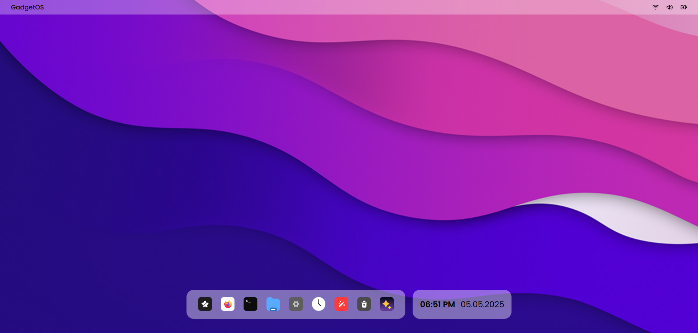

<div align="center">


# GadgetOS

**An AI-powered web operating system — manage files by meaning, execute in natural language, and build in the browser.**

[](https://nextjs.org)
[](https://convex.dev)
[](https://tailwindcss.com)
[](https://openai.com)
[](https://vercel.com)

<br />



</div>

---

## What is GadgetOS?

GadgetOS is a fully in-browser operating system experience built with Next.js. It features a macOS-inspired frosted glass desktop shell with real apps — a file explorer backed by Convex and S3, an AI terminal powered by GPT-4.1, a multi-tab text editor, an iframe browser with history and bookmarks, a clock, settings, and more.

---

## Features

| App | Highlights |
|-----|-----------|
| **File Explorer** | Folder tree, file list, image preview, text & semantic (vector) search via Convex |
| **Terminal** | `ls`, `cd`, `mkdir`, `touch`, `cat` wired to Convex filesystem — unknown commands answered by GPT-4.1 |
| **Text Editor** | Multi-tab editor that saves files directly to Convex |
| **Browser** | iframe browser with back/forward/reload stack, Convex-backed bookmarks bar and history, server-side proxy to bypass `X-Frame-Options` |
| **Clock** | Live analog + digital clock |
| **Settings** | Sidebar shell with appearance, profile, and shortcut stubs |
| **About** | System info panel |
| **Trash Bin** | Soft-delete destination for future file ops |
| **Desktop Shell** | Frosted glass navbar, animated floating dock, draggable/resizable windows with dnd-kit |

---

## Tech Stack

- **Framework** — [Next.js 16](https://nextjs.org) (App Router, React 19)
- **Database / Realtime** — [Convex](https://convex.dev) (queries, mutations, vector search)
- **Storage** — AWS S3 (file uploads, presigned URLs)
- **AI** — [OpenAI GPT-4.1](https://openai.com) (terminal fallback, image descriptions, embeddings)
- **UI** — [Tailwind CSS v4](https://tailwindcss.com), [Radix UI](https://radix-ui.com), [Lucide](https://lucide.dev), [Motion](https://motion.dev)
- **State** — [Zustand](https://zustand-demo.pmnd.rs)
- **Drag & Drop** — [dnd-kit](https://dndkit.com)
- **Analytics** — [Vercel Analytics](https://vercel.com/analytics) (production only)

---

## Getting Started

### Prerequisites

- Node.js 20+
- A [Convex](https://convex.dev) account
- An [OpenAI](https://platform.openai.com) API key
- An AWS S3 bucket

### 1. Clone & install

```bash
git clone https://github.com/Hitesh-s0lanki/gadgetOS.git
cd gadgetOS
npm install
```

### 2. Configure environment variables

```bash
cp .env.example .env.local
```

Fill in `.env.local`:

```env
# OpenAI
OPENAI_API_KEY=sk-proj-...

# AWS S3
GADGETOS_ACCESS_KEY_ID=AKIA...
GADGETOS_SECRET_ACCESS_KEY=your-secret-access-key
GADGETOS_REGION=ap-south-1
GADGETOS_S3_BUCKET=your-s3-bucket-name

# Convex
CONVEX_DEPLOYMENT=dev:your-deployment-name
NEXT_PUBLIC_CONVEX_URL=https://your-deployment-name.convex.cloud
```

### 3. Start Convex

```bash
npx convex dev
```

### 4. Run the dev server

```bash
npm run dev
```

Open [http://localhost:3001](http://localhost:3001) in your browser.

---

## Project Structure

```
gadgetos/
├── convex/              # Convex schema, queries & mutations
│   ├── schema.ts
│   ├── files.ts
│   ├── folders.ts
│   ├── browser.ts
│   └── ...
├── src/
│   ├── app/
│   │   ├── (public)/    # Landing page
│   │   ├── webos/       # Desktop shell & lock screen
│   │   └── api/         # Route handlers (proxy, upload, presign, AI terminal)
│   ├── components/
│   │   └── webos/
│   │       ├── apps/    # All OS apps (terminal, browser, file-explorer, …)
│   │       ├── desktop/ # Navbar, taskbar, desktop screen
│   │       ├── window/  # Draggable window base
│   │       └── ...
│   ├── hooks/webos/     # Per-app Zustand window stores
│   └── lib/             # OpenAI helpers
└── public/              # Static assets & icons
```

---

## API Routes

| Route | Method | Purpose |
|-------|--------|---------|
| `/api/proxy` | GET | Server-side web proxy — strips `X-Frame-Options` so sites render in the browser iframe |
| `/api/upload` | POST | Uploads a file to S3, writes a Convex record |
| `/api/presign` | GET | Generates a presigned S3 URL for image preview |
| `/api/openai-terminal` | POST | GPT-4.1 fallback for unknown terminal commands |

---

## Deployment

The project is deployed on [Vercel](https://vercel.com). Vercel Analytics is enabled automatically via the `VERCEL_ENV` environment variable — no additional configuration needed.

Make sure to add all environment variables from `.env.example` to your Vercel project settings, then deploy:

```bash
vercel --prod
```

---

## Contributing

1. Fork the repo
2. Create a feature branch (`git checkout -b features/your-feature`)
3. Commit your changes
4. Open a pull request against the `dev` branch

---

<div align="center">

Built with ❤️ using Next.js, Convex & OpenAI

</div>
